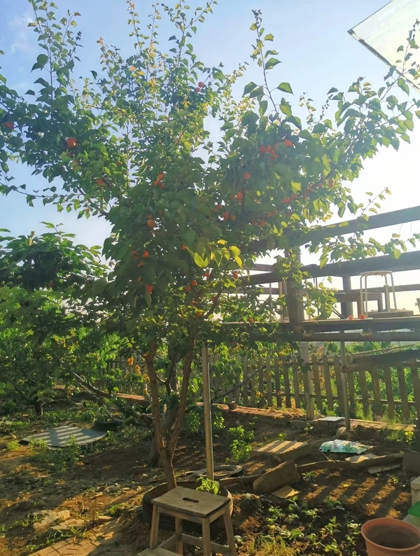
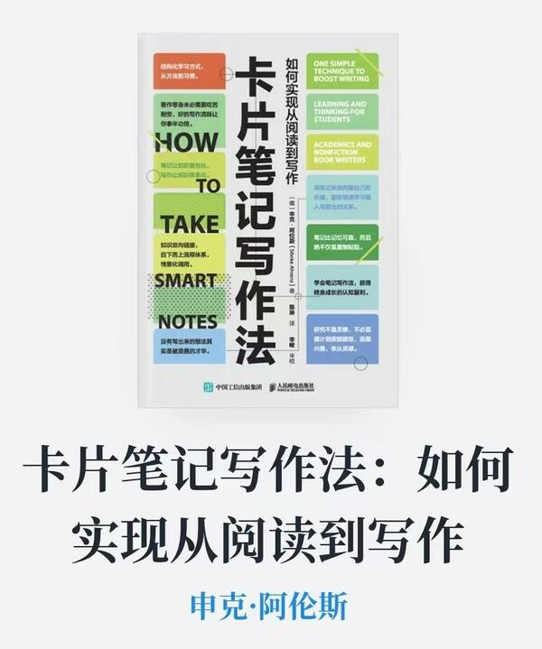
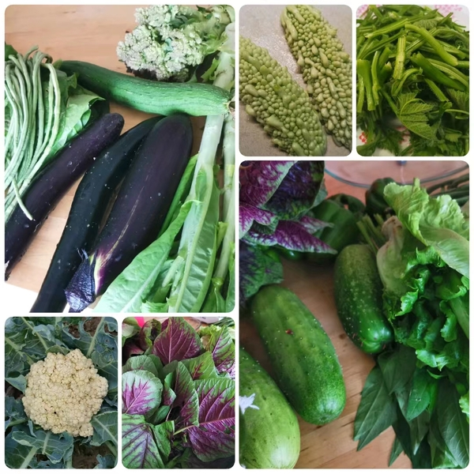

---
tags:
  - Newsletters
---

# 1# 是什么促使我开始做生活记录

最开始，是因为院子里那棵杏子树。

它起初是无意间扔在地里的一颗杏核，就这么自顾自地生长，从长叶、开花到结果，如今是第五年。  

我最近每天都会在院子里晨练，大约15分钟，正好对着这棵杏子树。  
六月初的一天，就这短短的15分钟，发生了一次[**杏子掉落事件**](../notes/20220615.md)，第二天，同样地，又掉了一个！  
从这个掉落的频率上看，大概率杏子进入成熟期了。今年是它第一次结这么多的果子，妥妥的大丰收。

嘿，这棵杏树就这样不疾不徐地生长，如期自然收获，人如果也能像杏子一样，安心生长，自然收获，那该多好啊！  
杏子掉落的时候，穿过树叶发出扑簌簌的声音，“**杏子扑簌簌**”，这五个字闪着光似的浮现在我眼前。这个ID很不错，于是回屋上若干平台注册了它。就这样，为自己埋了颗“小种子”。  

这是第一件事。

---

在寻觅笔记工具的过程中，顺便，或几乎是必然会发现[**《卡片笔记写作法》**](https://weread.qq.com/web/bookDetail/3d8326d072552e803d87c41)这本书。

  

感觉这是一本被名字耽误的好书，对我来说，它不仅讲述了一种写作方法，更仿佛在讲述该如何去经营人生。  

里面有很多想法与我的过往认知合拍，其中有一个观点对现在的我很重要：**^^尽管放手随着你的兴趣去探寻，只要把探寻过程中的经验沉淀下来，并耐心地进行组织关联，构成一个相互关联的网络，久而久之，对你真正重要、有价值的东西会自然会一一浮现。^^**

这，不是和杏子的自然生长过程一样吗？其实院子里还有一棵桃树，是专门种的，比杏树年长，目前结果状况还有点勉强；另外还有几颗樱桃树，平时很用心地照料，但仍然状况频发。  

^^我们习以为常的路径是先预设目标，再去奋力达成^^，如桃树和樱桃树。  
^^而这里的思路是：你无需预设目标，只需安心走走自己的路，目标/成果将会自然浮现^^，就像这棵杏子树。

作为一个年过四十，兴趣爱好广泛且无一深入的待结果人士，对灵魂三问中“我要去向何方”还感到非常地迷茫且好奇，像这种不用找方向、并且看起来是那么当下的方法，^^确实让人大大地释怀^^。  

这是第二件事。

---

六月中下旬，大儿原来所在华德福学校的小伙伴们开始了八年级的毕业项目展示。对此我们也很兴奋，借着这个机会回去跟小伙伴们会面。

一路，是我俩平日难得的独处时光，我们聊啊聊啊，快到学校时突然想起做毕业项目的孩子们，每个孩子的演讲都特别精彩，只是，从前一日孩子们的展示里可以看到，有些孩子的项目是自然长出来的，有些孩子的项目在选题的环节颇费了些周折。  
突然我联想到之前看的这本书，于是匆匆跟娃分享了关于这本书，上述发现和感受；还有因此而来的释放——^^好像可以不为孩子们和我自己的未来感到迷惑和焦虑了^^；外加一个不切实际的幻想——^^我是多希望能在他们这个年龄段就看到这本书啊^^！   
不过诚实地说，即便当时有机会看到，也未必能引起此刻的共鸣，不得不承认，^^一个人从外界能接收到的东西是与过往的生命经历息息相关的^^。

在回家的路上，我们继续之前的话题，大儿问我，妈妈你还记得你有一本纪念册吗？上面有很多同学的留言，你也给自己留了言，还留了两条呢。  
他跟我描述了那本纪念册的样子，那是我的小学纪念册，同学的留言我记得很清楚，但是我也写过？很疑惑。  
回家翻开看看，还真是：第一条留言写在大三暑假，满篇的奋发进取，满溢的是诸如考研考博、报效祖国这样的豪情壮志；第二条留言写在大四毕业的那个暑假，不过，气势忽地消散了，从“倒是考上了研究生。。。”到“希望我和妈妈身体健康”，一下务实了许多。  
另外，在“向往的职业”一栏，过去众多的理想变成了“自由职业”。有趣的是，从笔迹还可以看出，大四姐姐不仅在末尾注了日期(02/7)，还贴心地替前一页的豪气大三小妹补注了日期。

现在的我也不记得当时发生了什么，导致大四姐姐发生了这样的转变。如今(22/7)，整整时隔20年。上个周末，我在后面写下了第三篇留言，今后打算隔十年写一篇。  
看着后面的空白页，很好奇将来，它们又会承载怎样的故事呢？  

这是第三件事。

---

时光无法逆转，我不可能改变“二十年前的我”，不过“今天的我”是可以为“十年后的我”做点什么的。   至少，现在就应该来尝试这个卡片（Zettelkasten）工作系统吧：

1. **捕捉**：在生活中捕捉所见所闻所思所想。
2. **梳理**：理解并加工为自己的内容。
3. **存档**：将内容组织关联起来。
4. **输出**：在关联中发现关键线索，以写作等方式表达出来。
5. **分享**：就像现在这样。

尽管这个过程会消耗不少的时间精力，不过，^^在这个信息过载的时代，如果不主动使用自己的时间精力，它们也会不知不觉地被其他夺人眼球的东西给带走^^。相对而言，把资源投注在自己身上反而是一笔相当划算的交易不是么？

最后的分享环节有几个好处：

1. 促使自己以更客观的角度看自己  
1. 提供与外界交流的可能性
1. 借压力生动力&助持续

关于分享，计划用如下两个方式：

- 归档网站：[**安在-anzai.link**](https://anzai.link)做内容归档。选择网站做载体，因为：①数据放在自己手里才踏实；②灵活方便。  
    网站框架目前选择的是mkdocs+nginx的方案，我想在用一段时间以后，在立秋时分的第3期分享为什么选这个方案，以及搭建笔记和使用感受。
- Newsletter：[**竹白-杏子扑簌簌**](https://xingzipss.zhubai.love) 可订阅的期刊信。这种方式有三个我喜欢的特点：①去中心化；②不打扰无关的人；③有书信般的温度-收信人只需点击回复就可以很自然地与写信人建立一对一的联系。  
    在内容上，每期包含一个主题，另附若干固定的小专栏(是我正在关心或希望自己多加关心的事)。发布的周期对应二十四节气，负担不会太大，同时也提醒自己回归自然天地。

---

下面，轮到小专栏揭幕了：）

#### 做饭笔记
>
做饭是我现阶段最重要的工作，未来应该也是。  
事实上我是从今年年初才开始真正地成为一个做饭人的，妈妈也因此卸下了为一家子兜底一日三餐的负担。  
过去，做饭对我来说绝对是个负担，有时候甚至会想，人要是能充电就好了！  
妈妈不在家的日子，时常会出现到点吃不上饭的情况；现在呢，偶尔是负担，多半是享受，每顿饭我基本可以提前做好打算了。  
只是有点遗憾：我的妈妈，为我操持了40年，才等到了女儿供应的一日三餐；我的孩子们，个头都比我高了，他们的父母中才有一个人成长为合格的做饭人，大体结束了三餐不定的日子。

>
从负担到享受，我其实也做了不少努力，但有一个导火索事件：在视频[**【加醋的红烧肉】陈宗明师傅教的红烧肉**](https://www.bilibili.com/video/BV1cP4y1g73L?spm_id_from=333.337.search-card.all.click&vd_source=18f6693eab15b35c15b1b99513ee4321)里，受到了陈宗明老师傅的启示。真心敬佩这些老师傅，不仅教做菜，还能教做人。   
也因为这是近两年来，对我最重要的发生，所以想在下一期分享做饭相关的体悟。  

不由自主地，写这个笔记时，眼前就浮现出这样的画面：娃们长大后，在厨房一筹莫展的样子...  
希望将来的他们，到某个时节想不出吃该什么的时候，能上这儿来觅到他们儿时的解决方案。

❓ 夏天太热不想吃饭怎么办？  
💬 粥+馒头/凉面+泡菜+一个开胃的菜就可以。
 
❓ 馒头凉面怎么做？  
💬 等我慢慢写（*留坑，待补充*）
 
❓ 泡菜怎么做？  
💬 点->[四川泡菜](../recipes/r1.md)
 
❓ 开胃的菜有哪些？  
💬 我们这段时间时常/有计划上桌的有：蒜泥白肉（*待补充*），拌（空心菜/红苋菜/茄子/皮蛋青椒/豇豆）（*待补充*），肉沫酸豇豆（酸豇豆可以用上面的泡菜方法来做）（*待补充*），煎蛋（ 这能算开胃菜？我看不能，但是有个娃爱吃，也算一条思路吧）

❓ 凉面、拌菜用的辣椒油怎么做的？  
💬 点->[基础辣椒油](../recipes/r2.md)

#### 妈妈的小菜园
>
种菜是妈妈最钟爱的活动。一方小菜园，蕴藏着无尽的生命力。季节的变化在这里是最明显不过的了。

这些蔬菜都是这个季节收获的，有些菜长得不太好，有的菜收成不好，今年只有黄瓜是最成功的，长得又多又好！  
来，我们玩个游戏：你能看出下图有多少种菜吗？

关于菜园子的内容，这次准备得不够充分，对了，我们在第4期安排妈妈的小菜园及乡居生活体验吧。  
一不留神就安排到了第4期，我这杏子暂时结得还可以啊😃

---

好了，这就是杏子扑簌簌的第1期(壬寅·小暑)的期刊信，感谢阅读！  

如果觉得有趣，欢迎点击[**竹白-杏子扑簌簌**](https://xingzipss.zhubai.love)订阅更新💓

下一期话题 《做饭这件“小事”》将于7/23大暑时节发布，我们下期见！
