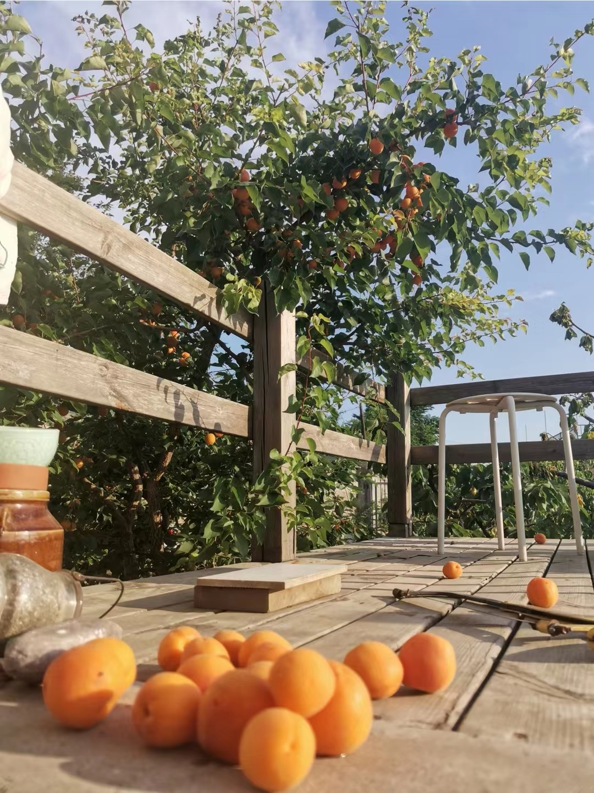

---
tags:
  - 生活随笔
---

# 2022，杏子扑簌簌

五年前无意在院子里扔下的一颗杏核，自己冒出了苗，长成了树。

三年前，小杏树开花了，开了满树的花，结了满树的小果儿，一边长，一边落，最终只有几枚杏子坚持到了橙黄香甜的时候。这是初次亮相，最重要的意义就是宣告了自己的身份吧：“我”，是一棵黄杏，一棵可以结出香甜果实的黄杏：）   

今年花期刚过，小果子依然挂了个满枝，时间一天天过去，小果子鼓成了大果子，和以往不同的是，这次它们中的绝大部分都行完了自己的征程，最终，橙黄透红的杏儿大约有200~300颗呢！

说真的，这是我吃过的最好吃的杏子了！可能是因为天天守着这棵杏树，等着杏子熟透掉下来才吃的缘故吧。杏子掉下来，如果落到湿润的土里，能给土面卧出一个小凹坑；如果落在坚实的砖面上，杏子可能会受伤；如果落在高起来的木平台上，杏子会很好，木头自然也不会有事。

从第一个杏子落下来起，每天我时不时地就往院子里跑，对地面任何杏橙色的物体都相当敏感。头几天，偶尔能捡到一个杏子，欢欣的感觉似曾相识，好像跟小时候从鸡窝里捡蛋一样。

一两周后，杏子掉得逐渐频繁起来：一个清晨，刚刚开始晨练，忽听“砰”的一声，只见一个杏子卧进了土里；第二天，同样的事情又发生了，这次听到的是"扑簌簌...砰！"，这是杏子穿过树叶砸到土里的声音，掉杏高峰期就这样来了，第三天一出门，发现木平台上竟然有那么多的杏儿，真让人满心欢喜！  

杏子和樱桃比起来，可真是急脾气，说熟就熟了：摸摸树枝上的杏子，有的轻轻一碰就掉下来，是熟得透透的那种；没有掉的杏，大部分果子尖尖触感都有些软了，用手握住一转，很轻松就能摘下来。

不再坐等杏落了，提着篮子摘了两篮熟得刚刚好的杏，一时半会是吃不完的，试着加工成[杏子罐头、杏子果酱还有杏干](../recipes/r3.md)，让杏子的陪伴延续得更久一些。

---
2022/6/15